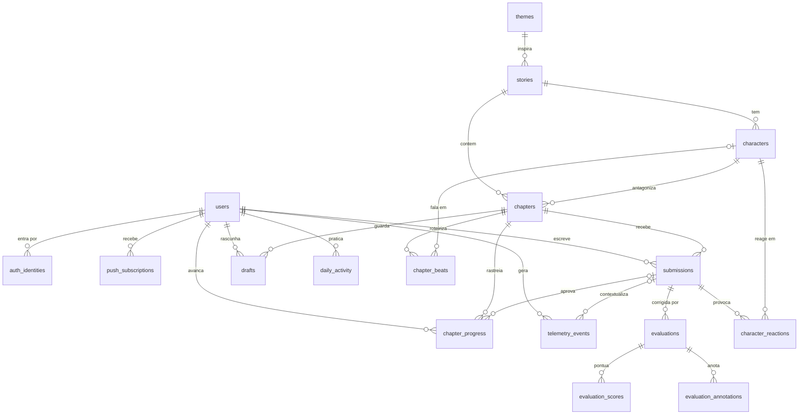
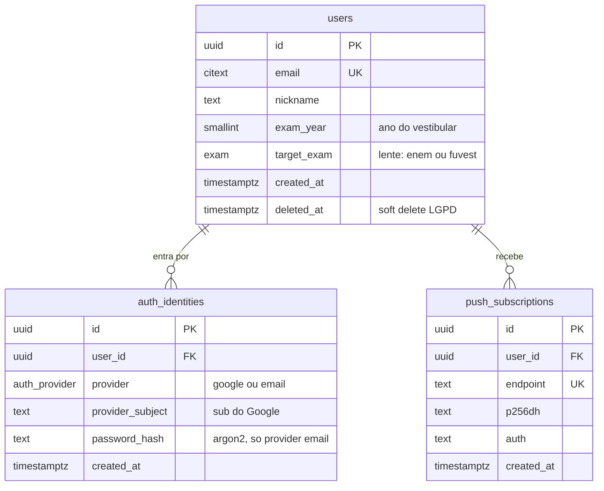
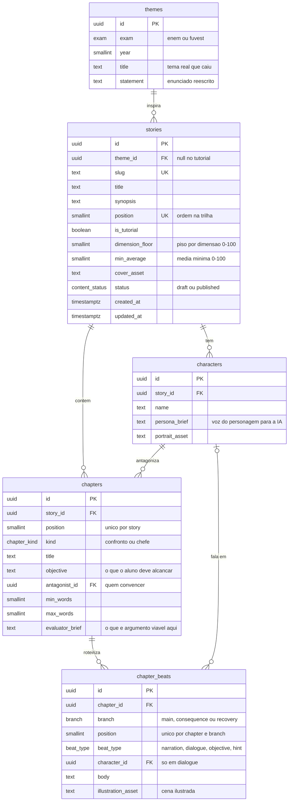
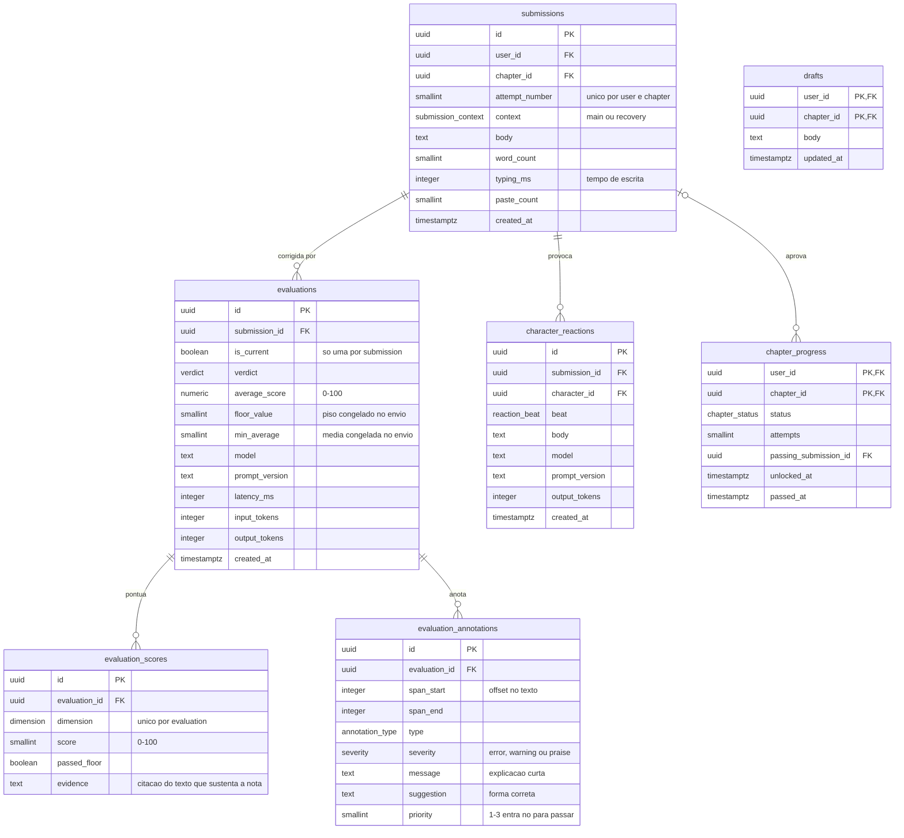
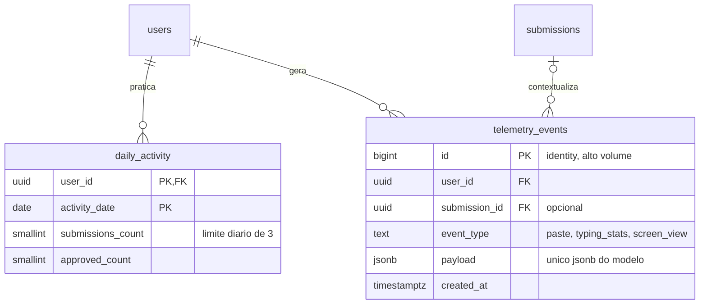

# DER: Argumenta

Versão 0.1, 2026-08-18. Modelo de dados do MVP em Postgres, derivado das decisões do
[PRD](./PRD.md). Identificadores em inglês, snake_case; chaves primárias `uuid`
(`gen_random_uuid()`); todo timestamp é `timestamptz`; extensões: `pgcrypto`, `citext`.

## Visão geral

Quatro domínios: **conta** (quem é o aluno), **conteúdo autoral** (o que os autores
escrevem), **jogo e avaliação** (o que o aluno faz e como o motor corrige) e
**hábito e telemetria** (streak, limite diário, eventos).

## Domínio 1: conta e identidade

Notas:

- `users` carrega só o mínimo LGPD do PRD: e-mail, apelido, ano de vestibular.
  Nada de nome completo, CPF, telefone, escola.
- Um usuário pode ter as duas identidades (Google e e-mail):
  `UNIQUE (user_id, provider)` e `UNIQUE (provider, provider_subject)`.
- Exclusão de conta: `deleted_at` marca; uma rotina de expurgo apaga as dependentes
  (`ON DELETE CASCADE`) e anonimiza o que precisar ser retido.

## Domínio 2: conteúdo autoral

Notas:

- `themes` guarda os temas reais de FUVEST/ENEM passados, com enunciado **reescrito
  em palavras próprias** (cautela com direitos autorais registrada no PRD).
- A dificuldade crescente da trilha mora em `stories.dimension_floor` e
  `stories.min_average` (piso por critério + média mínima do PRD).
- `chapters.evaluator_brief` alimenta a dimensão de persuasão do motor: descreve o
  que conta como argumento viável naquele contexto.
- `chapter_beats` é o esqueleto autoral: cada ramo (`main`, `consequence`,
  `recovery`) é uma sequência ordenada de batidas (narração, fala, objetivo, dica).
- O antagonista é por capítulo, não por história: capítulos podem trocar o
  interlocutor.

## Domínio 3: jogo e avaliação

Notas:

- **Motor único do PRD em forma de tabela**: `evaluation_scores` tem uma linha por
  dimensão (`norma_culta`, `coesao`, `coerencia`, `repertorio`, `persuasao`, e
  `proposta_intervencao` apenas na redação-chefe com lente ENEM). O gráfico de
  evolução por dimensão do Progresso vira um `GROUP BY` simples.
- **Evidência obrigatória**: `evaluation_scores.evidence` guarda a citação do texto
  que sustenta a nota, regra de confiabilidade do PRD.
- **Regra de aprovação congelada**: `floor_value` e `min_average` são copiados da
  story no momento do envio; recalibrar a régua depois não reescreve o passado.
- **Re-correção com histórico**: `evaluations` é 1-N por submission com
  `is_current` (índice único parcial `WHERE is_current`); quando `prompt_version`
  muda dá para re-corrigir e comparar sem perder nada.
- **Dois modos de falha do PRD** no enum `verdict`: `approved`,
  `failed_technical` (pausa e revisão) e `failed_persuasion` (ramo de consequência).
- `submissions.context` distingue o envio normal (`main`) do envio na cena de
  recuperação (`recovery`).
- `chapter_progress` é a única máquina de estados persistida
  (`locked`, `available`, `drafting`, `in_consequence`, `in_recovery`, `passed`);
  progresso de história e de trilha derivam dela por consulta.
- `drafts` é o rascunho com autosave, apagado quando o capítulo é aprovado.
- `character_reactions` guarda o que a IA fez o personagem responder ao texto real
  do aluno (rebate, convencido, abertura da consequência, chamada da recuperação),
  com custo em tokens para monitorar a conta de LLM.

## Domínio 4: hábito e telemetria

Notas:

- O limite de 3 correções/dia é um `UPSERT` atômico em `daily_activity` que
  incrementa `submissions_count` e rejeita acima do teto.
- Streak atual e recorde derivam de `daily_activity` (dias consecutivos com
  `submissions_count > 0`); nada denormalizado no MVP.
- Telemetria anti-cola sem bloqueio (decisão do PRD): eventos `paste` e
  `typing_stats` com payload livre em JSONB, o único JSONB do modelo, porque o
  formato é heterogêneo por natureza.

## Enums

| Enum | Valores | Usado em |
|------|---------|----------|
| `exam` | `enem`, `fuvest` | `users.target_exam`, `themes.exam` |
| `auth_provider` | `google`, `email` | `auth_identities.provider` |
| `content_status` | `draft`, `published` | `stories.status` |
| `chapter_kind` | `confronto`, `chefe` | `chapters.kind` |
| `branch` | `main`, `consequence`, `recovery` | `chapter_beats.branch` |
| `beat_type` | `narration`, `dialogue`, `objective`, `hint` | `chapter_beats.beat_type` |
| `submission_context` | `main`, `recovery` | `submissions.context` |
| `verdict` | `approved`, `failed_technical`, `failed_persuasion` | `evaluations.verdict` |
| `dimension` | `norma_culta`, `coesao`, `coerencia`, `repertorio`, `persuasao`, `proposta_intervencao` | `evaluation_scores.dimension` |
| `annotation_type` | `spelling`, `accentuation`, `punctuation`, `grammar`, `cohesion`, `coherence`, `repertoire_alert`, `repertoire_praise`, `persuasion` | `evaluation_annotations.type` |
| `severity` | `error`, `warning`, `praise` | `evaluation_annotations.severity` |
| `reaction_beat` | `rebuttal`, `convinced`, `consequence_intro`, `recovery_prompt` | `character_reactions.beat` |
| `chapter_status` | `locked`, `available`, `drafting`, `in_consequence`, `in_recovery`, `passed` | `chapter_progress.status` |

## Índices além das PKs/uniques

- `submissions (user_id, chapter_id)`: histórico de tentativas do capítulo.
- `evaluations (submission_id) WHERE is_current`: único parcial, garante uma
  avaliação corrente por envio.
- `evaluation_scores (evaluation_id)` e, para o gráfico de evolução,
  `evaluation_scores (dimension)` combinado com join em `evaluations.created_at`.
- `telemetry_events (user_id, created_at)`: consultas por aluno e período.
- `chapter_beats (chapter_id, branch, position)`: leitura do roteiro em ordem.

## Decisões de modelagem

1. **Tabelas tipadas, não sacos de JSON.** Notas por dimensão e anotações são
   linhas com colunas e enums; JSONB existe só em `telemetry_events.payload`.
   Consulta, índice e integridade vêm de graça, e o gráfico de evolução por
   dimensão é um agregado trivial.
2. **A régua viaja com a avaliação.** Piso e média mínima são congelados em
   `evaluations` no momento do envio; a trilha pode ser recalibrada sem efeito
   retroativo.
3. **Uma única máquina de estados.** Só `chapter_progress` persiste estado de
   progresso; história concluída e trilha desbloqueada são derivações. Menos
   estado, menos chance de incoerência.
4. **Calibração é cidadã do modelo.** `model` e `prompt_version` em toda avaliação
   e reação; a suíte de regressão (pytest) referencia essas versões.
5. **LGPD por construção.** Coleta mínima em `users`, soft delete com expurgo,
   textos do aluno tratados como dado pessoal no expurgo.

## O que fica fora do banco

- **Mapeamento de lentes** (dimensões para C1-C5 do ENEM ou eixos FUVEST): vive no
  código, versionado junto de `prompt_version`.
- **Prompts do motor e das reações**: arquivos no repositório, versionados no git.
- **Suíte de calibração**: fixtures e testes pytest, não linhas de produção.
- **Assets** (ilustrações, retratos, capas): storage estático/S3; o banco guarda o
  caminho.
